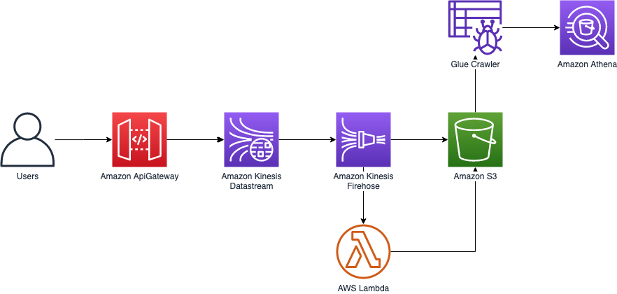
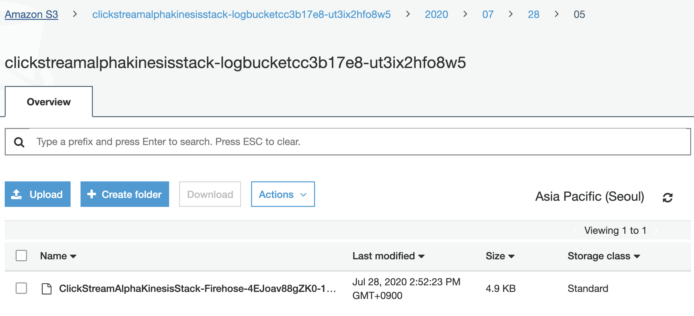
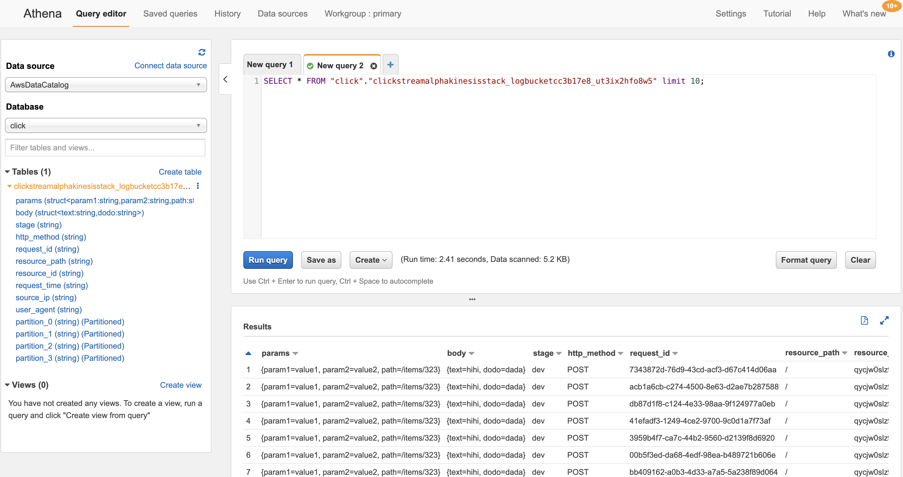

# API Gateway - Kinesis Logging

This repository is for guide how to log API Gateway requests to S3 using Kinesis

Running this tutorial will provision below architecture on your AWS Account



**Running this repository may cost you to provision AWS resources**

# Prerequisites

- awscli
- Nodejs 18+
- Python 3.11
- AWS Account and Locally configured AWS credential

# Installation

Install project dependencies

```bash
$ npm i
```

Install cdk in global context and run `cdk init` if you did not initailize cdk yet.

```bash
$ npm i -g cdk@2.104.0
$ cdk init
$ cdk bootstrap
```

Deploy CDK Stacks on AWS

```bash
$ cdk deploy "*" --require-approval never
```

# Usage

1. Invoke API Gateway endpoint with some data (I used [HTTPie](https://httpie.io/))

```bash
$ http post https://act1cqfmhh.execute-api.ap-northeast-2.amazonaws.com/dev/\?path\=/items/323\&param1\=value1\&param2\=value2 text=hihi dodo=dada

HTTP/1.1 200 OK
Connection: keep-alive
Content-Length: 133
Content-Type: application/json
Date: Mon, 27 Jul 2020 09:50:34 GMT
X-Amzn-Trace-Id: Root=1-5f1ea36a-2e0004ffc4872e731c05c655
x-amz-apigw-id: QU54lHRnIE0FVug=
x-amzn-RequestId: 7b0c6ced-54f2-41a6-b6eb-67c34757f4ee

{
    "EncryptionType": "KMS",
    "SequenceNumber": "49609269679743302945603165999532102289236812540189605890",
    "ShardId": "shardId-000000000000"
}
```

2. Open S3 bucket to check if your data is stored well

```json
{"params": {"param1": "value1","param2": "value2","path": "\/items\/323"},"body": {"text":"hihi","dodo":"dada"},"stage": "dev","http_method": "POST","request_id": "7343872d-76d9-43cd-acf3-d67c414d06aa","resource_path": "/","resource_id": "qycjw0slz9","request_time": "28/Jul/2020:01:31:24 +0000","source_ip": "54.239.119.16","user_agent": "HTTPie/2.1.0"}
...
```

3. Check out S3 stored logs



4. Query S3 with Amazon Athena using Glue Crawler (with just few clicks)



# Cleanup Resource

Remove all resources used in this tutorial.

```bash
$ cdk destroy "*"
```
